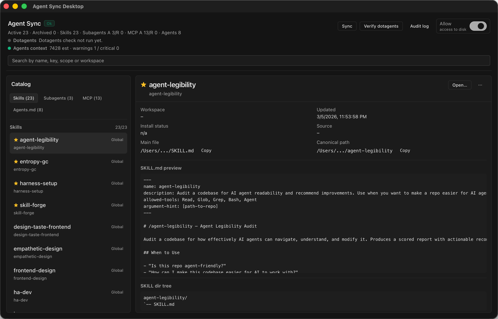

> [!CAUTION]
> **Pre-alpha concept.**
> This is my personal attempt to build tooling for myself.
> I'm still putting it together, so it can break and change a lot.
> I'll keep improving it step by step toward a real product.
> Use it at your own risk.

## What is this project?
Agent Sync is a desktop app and CLI built on [Sentry dotagents](https://github.com/getsentry/dotagents) that keeps one canonical catalog of skills, subagents, and managed MCP servers synchronized across agent runtimes, and it is in active alpha development with daily real-world use by the developer.

## What problems does it solve?
It stops configuration drift when the same assets live across Claude, Cursor, Codex, and shared agent directories.
It removes repetitive manual copying and relinking by rebuilding managed links and managed config blocks from a single source of truth.
It makes cross-agent behavior predictable by detecting conflicts and applying deterministic sync results.

## Screenshot


## Run on macOS / Windows / Linux
### macOS
GUI:
```bash
./scripts/run-tauri-gui.sh
```
CLI:
```bash
cd platform && cargo run -p agent-sync-cli -- sync --scope all --json
```

### Windows (PowerShell)
GUI:
```powershell
cd platform/apps/agent-sync-desktop/ui; npm install; cd ../src-tauri; cargo tauri dev
```
CLI:
```powershell
cd platform; cargo run -p agent-sync-cli -- sync --scope all --json
```

### Linux
GUI:
```bash
./scripts/run-tauri-gui.sh
```
CLI:
```bash
cd platform && cargo run -p agent-sync-cli -- sync --scope all --json
```

Details: [docs/SETUP.md](docs/SETUP.md)
