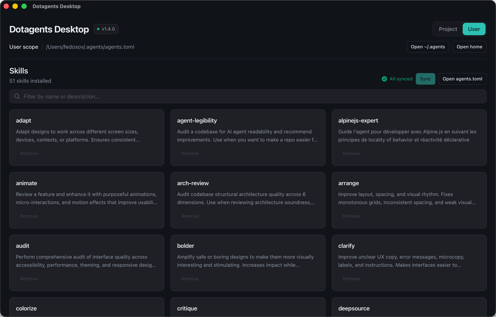

# Dotagents Desktop

UI for `dotagents` [`@sentry/dotagents` 1.4.0](https://dotagents.sentry.dev/cli).

> [!CAUTION]
> **Pre-alpha concept.**
> This is my personal attempt to build tooling for myself.
> I'm still putting it together, so it can break and change a lot.
> I'll keep improving it step by step toward a real product.
> Use it at your own risk.

## Why?

I find it easier to manage data when I can see it in the interface. I can add skills through the cli or create them in Claude Code, but I need to see a reference or cheat sheet with the available skills when I use them or decide to remove some of them.
